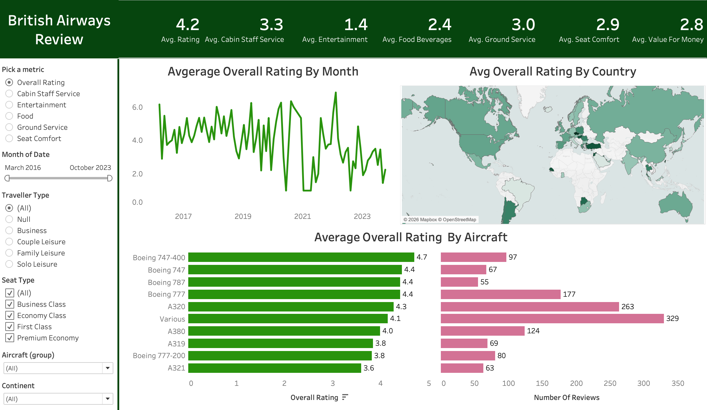

# Tableau-Airline-Passenger-Satisfaction

# ✈️ Airline Passenger Satisfaction Analysis (Tableau)

## 📚 Overview
The **Airline Passenger Satisfaction Analysis** is an interactive Tableau dashboard built to analyze **British Airways passenger review data** and evaluate customer experience across multiple service dimensions.  

The dashboard enables users to **dynamically switch metrics**—such as Overall Rating, Cabin Staff Service, Entertainment, Food & Beverages, and Seat Comfort—using a single parameter-driven control.

It helps stakeholders quickly identify:
- Trends in passenger satisfaction over time  
- Differences in ratings by country and aircraft type  
- Which service areas most impact overall experience  
- How review volume relates to perceived performance  

The project emphasizes **interactivity, clarity, and user-driven analysis** using advanced Tableau functionality.

---

## 🖼 Report Preview

---

## 🎯 Key Features
- **Parameter-Driven Metric Selection** – Instantly toggle between multiple rating metrics  
- **KPI Summary Section** – Displays average ratings for key service areas at a glance  
- **Ratings Over Time** – Line chart showing how passenger satisfaction changes month by month  
- **Geographic Analysis** – Map visual highlighting average ratings by country  
- **Aircraft Performance Comparison** – Bar charts comparing average ratings and number of reviews by aircraft model  
- **Visual-as-Filter Interactions** – Clicking any chart dynamically filters the entire dashboard  
- **Advanced Filtering** – Filter by date range, traveler type, seat class, aircraft group, and continent  

---

## 🛠 How It Was Built
- **Data Sources:** Real-world airline passenger review data (CSV files)  
- **Tools:** Tableau Desktop for dashboard development, Tableau Public for sharing  
- **Techniques Used:**  
  - Parameters for dynamic metric switching  
  - Calculated fields for average ratings and review counts  
  - Action filters enabling cross-visual interaction  
  - Grouping logic to consolidate low-volume aircraft into a “Various” category  
- **Visuals:** KPI tiles, line charts, maps, and comparative bar charts designed for usability  

---

## 🚀 Outcome
- Fully interactive **Tableau dashboard** built end-to-end  
- Demonstrates strong use of **parameters, calculated fields, and action filters**  
- Allows users to explore passenger satisfaction from multiple analytical angles  
- Presents complex review data in a **clear, decision-focused layout**  

---

## 📝 Conclusion
The **Airline Passenger Satisfaction Analysis** demonstrates how airline review data can be transformed into **interactive, actionable insights**. It highlights trends in **passenger ratings, service quality, and aircraft performance**, providing a clear view of the factors influencing overall customer experience.
